# SAMC Supabase 스키마 개요 (ER Diagram)

- **작성일**: 2026-04-18
- **출처**: `backend/db/combined_schema.sql`, `backend/db/migrations/001~013`, `backend/db/feature4/schema.sql`
- **기준 커밋**: `85e8d4f` (branch: BC)
- **Supabase 프로젝트**: `bnfgbwwibnljynwgkgpt` (세연님 프로젝트)

---

## 1. Prefix 규칙 (combined_schema.sql §7)

| Prefix | 영역 | 담당 |
|---|---|---|
| (없음) | 전체 공통 파이프라인 | 공유 |
| `f1_` | 수입 가능 여부 판정 | 병찬 |
| `f2_` | 식품유형 분류 | 아람 |
| `f3_` | 수입 필요서류 안내 | 미정 |
| `f4_` | 수출국표시사항 검토 | 성은 |
| `f5_` | 한글표시사항 검토 | 세연 |

**DB 변경 룰**
- `f1_` prefix 테이블만 F1 도메인에서 신규 생성 가능
- 컬럼 추가는 `DEFAULT` + migration 파일 (breaking change 금지)
- 공통 테이블(`cases`, `documents`, `pipeline_steps`, `law_alerts`, `feedback_logs`) 수정은 PM(성은) 사인오프 필수
- 법령 데이터는 `law_source` + `is_verified=true` 의무

---

## 2. 전체 ER Diagram

```mermaid
erDiagram
    %% ============================================================
    %% [공통] 전체 기능 공유 파이프라인 — 5 tables
    %% ============================================================

    auth_users {
        UUID id PK
    }

    cases {
        UUID id PK
        TEXT product_name
        TEXT importer_name
        TEXT status "processing|completed|on_hold|error"
        TEXT current_step
        UUID parent_case_id FK
        UUID created_by FK
        UUID locked_by FK
        TIMESTAMPTZ locked_at
        TIMESTAMPTZ created_at
        TIMESTAMPTZ updated_at
    }

    documents {
        UUID id PK
        UUID case_id FK
        TEXT doc_type "ingredients|process|msds|material|label|other"
        TEXT file_name
        TEXT storage_path
        TEXT mime_type
        TEXT parsed_md
        BOOLEAN is_verified
        TIMESTAMPTZ created_at
    }

    pipeline_steps {
        UUID id PK
        UUID case_id FK
        TEXT step_key "1|2|A|B|6"
        TEXT step_name
        TEXT status "pending|running|waiting_review|completed|error"
        JSONB ai_result
        JSONB final_result
        UUID edited_by FK
        TEXT edit_reason
        JSONB law_references
        TIMESTAMPTZ created_at
        TIMESTAMPTZ updated_at
    }

    law_alerts {
        UUID id PK
        TEXT law_name
        TEXT change_summary
        INT_ARRAY affected_steps
        UUID file_uploaded_by FK
        BOOLEAN email_sent
        TIMESTAMPTZ email_sent_at
        TIMESTAMPTZ created_at
    }

    feedback_logs {
        UUID id PK
        UUID case_id FK
        TEXT step_key
        JSONB ai_suggestion
        JSONB final_value
        TEXT edit_reason
        UUID user_id FK
        TIMESTAMPTZ created_at
    }

    cases ||--o{ documents : "case_id"
    cases ||--o{ pipeline_steps : "case_id"
    cases ||--o{ feedback_logs : "case_id"
    cases ||--o| cases : "parent_case_id"
    auth_users ||--o{ cases : "created_by/locked_by"
    auth_users ||--o{ pipeline_steps : "edited_by"
    auth_users ||--o{ feedback_logs : "user_id"
    auth_users ||--o{ law_alerts : "file_uploaded_by"

    %% ============================================================
    %% [F1] 수입 가능 여부 판정 — 담당: 병찬
    %% ============================================================

    f1_allowed_ingredients {
        UUID id PK
        TEXT name_ko
        TEXT name_en
        TEXT scientific_name
        TEXT ins_number UK
        TEXT cas_number UK
        TEXT allowed_status "permitted|restricted|prohibited"
        TEXT conditions
        TEXT law_source
        BOOLEAN is_verified
        UUID created_by FK
        TIMESTAMPTZ created_at
        TIMESTAMPTZ updated_at
    }

    f1_additive_limits {
        UUID id PK
        TEXT food_type
        TEXT additive_name
        TEXT ins_number
        NUMERIC max_ppm
        TEXT combined_group
        NUMERIC combined_max
        NUMERIC conversion_factor
        TEXT colorant_category "tar|non-tar|natural"
        TEXT color_group
        NUMERIC total_tar_limit
        TEXT condition_text
        TEXT regulation_ref
        BOOLEAN is_verified
        UUID verified_by FK
        TIMESTAMPTZ verified_at
        UUID created_by FK
        TIMESTAMPTZ created_at
        TIMESTAMPTZ updated_at
    }

    f1_safety_standards {
        UUID id PK
        TEXT food_type
        TEXT standard_type "microbe|heavy_metal|pesticide|contaminant|alcohol"
        TEXT target_name
        TEXT max_limit "TEXT: 불검출|음성|0.1 mg/kg"
        TEXT regulation_ref
        TEXT condition_text
        BOOLEAN is_verified
        UUID verified_by FK
        TIMESTAMPTZ verified_at
        UUID created_by FK
        TIMESTAMPTZ created_at
        TIMESTAMPTZ updated_at
    }

    f1_ingredient_synonyms {
        UUID id PK
        TEXT name_standard
        TEXT name_variant
        TEXT language "ko|en|ja|zh|la"
        TIMESTAMPTZ created_at
    }

    f1_forbidden_ingredients {
        UUID id PK
        TEXT name_ko
        TEXT name_en
        TEXT_ARRAY aliases
        TEXT category "drug|endangered|unauthorized|toxin|other"
        TEXT law_source
        TEXT reason
        BOOLEAN is_verified
        UUID created_by FK
        TIMESTAMPTZ created_at
        TIMESTAMPTZ updated_at
    }

    f1_escalation_logs {
        UUID id PK
        UUID case_id FK
        TEXT module_id "F1"
        TEXT trigger_type "forbidden_hit|prohibited_detected|low_confidence|compound_prohibited|synthetic_flavor|standards_violation|alcohol_boundary|no_data"
        NUMERIC confidence_score "0.0~1.0"
        TEXT reason
        BOOLEAN resolved
        UUID resolved_by FK
        TIMESTAMPTZ resolved_at
        TEXT resolution_note
        TIMESTAMPTZ created_at
    }

    f1_law_chunks {
        UUID id PK
        TEXT vector_id UK
        TEXT regulation_id
        TEXT pinecone_namespace "food_code_text|additive_code_text|functional_labeling|temporary_standard|health_food_text"
        TEXT section_path
        TEXT text
        INT token_count
        INT chunk_index
        INT total_chunks
        TIMESTAMPTZ embedded_at
        TIMESTAMPTZ created_at
    }

    f1_food_types {
        UUID id PK
        TEXT TODO "컬럼 정의 미완료"
        TIMESTAMPTZ created_at
        TIMESTAMPTZ updated_at
    }

    f1_regulations {
        UUID id PK
        TEXT TODO "컬럼 정의 미완료"
        TIMESTAMPTZ created_at
        TIMESTAMPTZ updated_at
    }

    f1_reviews {
        UUID id PK
        TEXT TODO "컬럼 정의 미완료"
        TIMESTAMPTZ created_at
        TIMESTAMPTZ updated_at
    }

    f1_allergens {
        UUID id PK
        TEXT TODO "컬럼 정의 미완료"
        TIMESTAMPTZ created_at
    }

    f1_analytics_events {
        UUID id PK
        TEXT TODO "컬럼 정의 미완료"
        TIMESTAMPTZ created_at
    }

    f1_flavor_codes {
        UUID id PK
        TEXT TODO "컬럼 정의 미완료"
        TIMESTAMPTZ created_at
    }

    f1_material_codes {
        UUID id PK
        TEXT TODO "컬럼 정의 미완료"
        TIMESTAMPTZ created_at
    }

    f1_process_codes {
        UUID id PK
        TEXT TODO "컬럼 정의 미완료"
        TIMESTAMPTZ created_at
    }

    f1_regulation_updates {
        UUID id PK
        TEXT TODO "컬럼 정의 미완료"
        TIMESTAMPTZ created_at
    }

    f1_review_items {
        UUID id PK
        TEXT TODO "컬럼 정의 미완료"
        TIMESTAMPTZ created_at
    }

    cases ||--o{ f1_escalation_logs : "case_id"
    auth_users ||--o{ f1_allowed_ingredients : "created_by"
    auth_users ||--o{ f1_additive_limits : "created_by/verified_by"
    auth_users ||--o{ f1_safety_standards : "created_by/verified_by"
    auth_users ||--o{ f1_forbidden_ingredients : "created_by"
    auth_users ||--o{ f1_escalation_logs : "resolved_by"
    f1_allowed_ingredients }o..o{ f1_ingredient_synonyms : "논리 FK (name_standard↔name_ko)"

    %% ============================================================
    %% [F2] 식품유형 분류 — 담당: 아람
    %% ============================================================

    f2_required_documents {
        BIGSERIAL id PK
        TEXT food_type
        TEXT condition
        TEXT doc_name
        TEXT doc_description
        BOOLEAN is_mandatory
        TEXT law_source
        TIMESTAMPTZ created_at
    }

    %% ============================================================
    %% [F4] 수출국표시사항 검토 — 담당: 성은
    %% ============================================================

    f4_law_documents {
        UUID id PK
        TEXT law_name
        TEXT 고시번호
        DATE 시행일
        TEXT source_file
        INT 법령_tier "1=법률 2=시행령 3=시행규칙 4=고시"
        INT total_chunks
        TEXT_ARRAY prohibition_hint_patterns
        TIMESTAMPTZ created_at
    }

    f4_prohibited_expressions {
        UUID id PK
        TEXT keyword
        TEXT category "질병치료|허위과장|의약품오인|기능성|비방광고"
        TEXT severity "must_fix|review_needed"
        TEXT law_ref
        UUID law_document_id FK
        TEXT example
        TIMESTAMPTZ created_at
    }

    f4_image_violation_types {
        UUID id PK
        TEXT type_name UK
        TEXT sub_items "쉼표 구분"
        TEXT default_severity "must_fix|review_needed"
        TEXT severity_condition
        TEXT law_ref
        TEXT source "seed|auto"
        TEXT source_law_name
        BOOLEAN is_active
        TEXT review_note
        TIMESTAMPTZ created_at
        TIMESTAMPTZ updated_at
    }

    f4_law_documents ||--o{ f4_prohibited_expressions : "law_document_id"

    %% ============================================================
    %% [F5] 한글표시사항 검토 — 담당: 세연
    %% ============================================================

    f5_label_rules {
        UUID id PK
        TEXT ingredient_pattern
        TEXT rule
        TEXT source
        TEXT food_type
        UUID created_by FK
    }

    f5_allergy_list {
        UUID id PK
        TEXT name_ko
        TEXT_ARRAY aliases
        TEXT label_text
        TEXT source
        UUID created_by FK
    }

    f5_additive_label_rules {
        UUID id PK
        TEXT additive_name
        TEXT mandatory_label
        TEXT source
        UUID created_by FK
    }

    f5_gmo_ingredients {
        UUID id PK
        TEXT name_ko
        NUMERIC threshold_pct
        TEXT label_text
        TEXT source
        UUID created_by FK
    }

    f5_law_chunks {
        UUID id PK
        TEXT TODO "세연님 컬럼 정의 미완료"
        TIMESTAMPTZ created_at
    }

    f5_thresholds {
        UUID id PK
        TEXT ingredient_name
        TEXT food_type
        NUMERIC threshold_value
        TEXT unit
        TEXT condition_text
        TEXT compound_group
        BOOLEAN is_compound_limit
        TEXT law_source
        TEXT law_article
        BOOLEAN is_verified
        TIMESTAMPTZ extracted_at
        UUID verified_by FK
        TIMESTAMPTZ verified_at
        UUID created_by FK
    }

    f5_ingredient_list {
        UUID id PK
        TEXT name_ko
        TEXT name_scientific
        TEXT name_en
        TEXT ins_number
        TEXT cas_number
        TEXT_ARRAY aliases
        TEXT usage_part
        TEXT usage_condition
        BOOLEAN is_allowed
        TEXT law_source
        UUID created_by FK
    }

    f5_required_documents {
        UUID id PK
        TEXT food_type
        TEXT condition
        TEXT doc_name
        TEXT doc_description
        BOOLEAN is_mandatory
        TEXT law_source
        UUID created_by FK
    }

    auth_users ||--o{ f5_label_rules : "created_by"
    auth_users ||--o{ f5_allergy_list : "created_by"
    auth_users ||--o{ f5_additive_label_rules : "created_by"
    auth_users ||--o{ f5_gmo_ingredients : "created_by"
    auth_users ||--o{ f5_thresholds : "created_by/verified_by"
    auth_users ||--o{ f5_ingredient_list : "created_by"
    auth_users ||--o{ f5_required_documents : "created_by"
```



---

## 3. 파이프라인 흐름 (step_key 규약)

| step_key | 단계명 | 담당 기능 |
|---|---|---|
| `1` | 수입 가능 여부 판정 | F1 |
| `2` | 식품유형 분류 | F2 |
| `A` | 수입 필요서류 안내 | F3 |
| `B` | 수출국표시사항 검토 | F4 |
| `6` | 한글표시사항 검토 | F5 |

결과 저장: `pipeline_steps.ai_result` (JSONB) → 담당자 확인 후 `final_result` 복사.

---

## 4. 상태별 테이블 통계 (2026-04-18 기준)

| 그룹 | 테이블 수 | 상태 |
|---|---|---|
| 공통 | 5 | 확정 |
| F1 확정 | 7 | 컬럼 정의 완료 (migrations 002~013) |
| F1 스켈레톤 | 10 | `id + created_at`만 존재 — TODO |
| F2 | 1 | 확정 |
| F3 | 0 | 담당 미정 |
| F4 | 3 | 확정 |
| F5 확정 | 7 | 컬럼 정의 완료 |
| F5 스켈레톤 | 1 | `f5_law_chunks` TODO |
| **합계** | **34** | — |

---

## 5. F1 인덱스 / 확장 / RLS (migrations 001·008·009)

- **pg_trgm 확장**: 001에서 활성화 (한글 유사도 검색용)
- **GIN trgm 인덱스**: `f1_safety_standards.target_name`, `f1_forbidden_ingredients.name_ko`, `f1_ingredient_synonyms.name_variant`
- **유니크 제약**:
  - `f1_allowed_ingredients` — `ins_number`, `cas_number` (partial unique)
  - `f1_safety_standards` — `(food_type, standard_type, target_name)`
  - `f1_ingredient_synonyms` — `(name_standard, name_variant, language)`
- **RLS**: `f1_law_chunks`만 RLS 활성화 (SELECT: 전체 허용, 쓰기: service_role)

---

## 6. 검증 쿼리

```sql
-- 전체 테이블 목록 확인
SELECT tablename FROM pg_tables WHERE schemaname = 'public' ORDER BY tablename;

-- F1 seed 건수 확인
SELECT allowed_status, COUNT(*)
  FROM f1_allowed_ingredients
 GROUP BY allowed_status;

-- 에스컬레이션 미해결 건수
SELECT COUNT(*) FROM f1_escalation_logs WHERE resolved = false;
```

---

## 7. 참고

- 공통 테이블 수정은 **PM(성은) 사인오프 필수** — `combined_schema.sql` L32~33
- F5 테이블은 기존 `label_rules` 등에서 `f5_` prefix rename 필요 — `combined_schema.sql` L343~350
- F1 RAG 청크 미러는 `f1_law_chunks` ↔ Pinecone `samc-law-f1` 인덱스 연동
